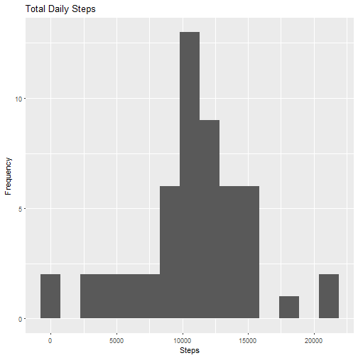
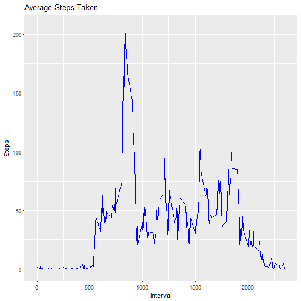
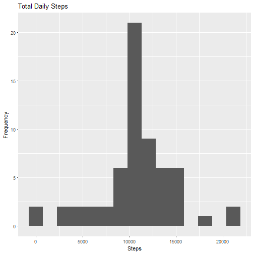
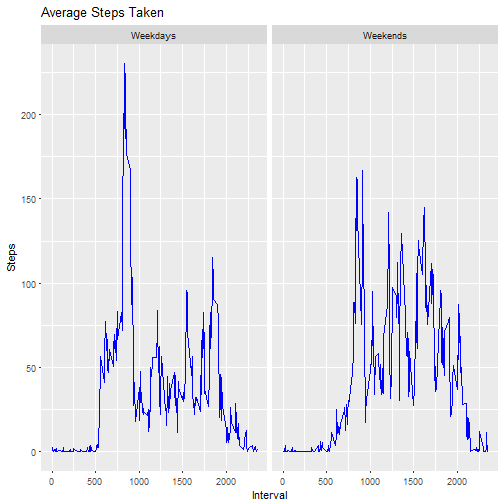

---
title: "Project 1"
author: "Marcelo Urbano"
date: "September, 22 2017"

output: 
  html_document:
    keep_md: true


## 1 - Reading and processing data

### Setting directory, unzipping and loading data

```r
setwd("C:/Users/Marcelo/Dropbox/Pessoais/Curso Data Science/Curso 5 - Reproducible Research/19 - Course Project 1")
unzip("activity.zip")
df1 <- read.csv( "activity.csv",stringsAsFactors = FALSE)
```

### Initial data exploration

```r
str(df1)
```

```
## 'data.frame':	17568 obs. of  3 variables:
##  $ steps   : int  NA NA NA NA NA NA NA NA NA NA ...
##  $ date    : chr  "2012-10-01" "2012-10-01" "2012-10-01" "2012-10-01" ...
##  $ interval: int  0 5 10 15 20 25 30 35 40 45 ...
```

```r
head(df1)
```

```
##   steps       date interval
## 1    NA 2012-10-01        0
## 2    NA 2012-10-01        5
## 3    NA 2012-10-01       10
## 4    NA 2012-10-01       15
## 5    NA 2012-10-01       20
## 6    NA 2012-10-01       25
```

```r
sum(is.na(df1$steps))
```

```
## [1] 2304
```

```r
sum(is.na(df1$steps)) / nrow(df1)
```

```
## [1] 0.1311475
```

```r
sum(is.na(df1$date))
```

```
## [1] 0
```

```r
sum(is.na(df1$interval))
```

```
## [1] 0
```
We´have NA values in steps variable


```r
## Removing observations with NA
df2 <- df1[!is.na(df1$steps),]
```

### Loading libraries

```r
library(dplyr)
library(ggplot2)
```

## 2 - Plotting Histogram - number of steps taken each day


```r
## Grouping and summarizing
sum1 <- group_by(df2,date)
sum2 <- summarise(sum1, nsd = sum(steps))
## Plotting
ggplot(sum2,aes(sum2$nsd))+geom_histogram(bins=15) + labs(title="Total Daily Steps") + labs( x ="Steps",y = "Frequency")
```



## 3 - Mean and Median number of steps taken each day

### Mean

```r
mean(sum2$nsd)
```

```
## [1] 10766.19
```

### Median

```r
median(sum2$nsd)
```

```
## [1] 10765
```

## 4 - Time series plot of the average number of steps taken


```r
## Creating summary
sum3 <- group_by(df2,interval)
sum4 <- summarise(sum3, ns = sum(steps), oc = n(), av=ns/oc)
## Plotting
ggplot(sum4,aes(interval,av)) + geom_line(color="blue") + labs(title="Average Steps Taken") + labs( x ="Interval",y = "Steps")
```



## 5 - The 5-minute interval that, on average, contains the maximum number of steps


```r
sum4$interval[which(sum4$av == max(sum4$av))]
```

```
## [1] 835
```

## 6 - Code to describe and show a strategy for imputing missing data
We will replace missing data (in this case NA values for steps column) by inputing the average step number for the same interval


```r
## Merging frames by interval
df3 <- merge(df1,sum4,by="interval")
## Replacing NA with average for the same interval 
df3$steps[is.na(df3$steps)] <- df3$av[is.na(df3$steps)]
```

## 7 - Histogram of the total number of steps taken each day after missing values are imputed


```r
## Grouping and summarizing
sum5 <- group_by(df3,date)
sum6 <- summarise(sum5, nsd = sum(steps))
## Plotting
ggplot(sum6,aes(sum6$nsd))+geom_histogram(bins=15) + labs(title="Total Daily Steps") + labs( x ="Steps",y = "Frequency")
```



## 8 - Panel plot comparing the average number of steps taken per 5-minute interval across weekdays and weekends


```r
## Creating day of week and daytype cols
df3$date <- as.Date(df3$date)
df3 <- mutate( df3, daynumber = as.POSIXlt(df3$date)$wday )
labels <- c("Weekdays","Weekends")
df3 <- mutate( df3, daytype = labels[1  + ((daynumber==0) | (daynumber==6))])
## Creating summary
sum7 <- group_by(df3,daytype,interval)
sum8 <- summarise(sum7, ns = sum(steps), oc = n(), av=ns/oc)
## Plotting
ggplot(sum8,aes(interval,av)) + geom_line(color="blue") + labs(title="Average Steps Taken") + labs( x ="Interval",y = "Steps") + facet_wrap("daytype")
```



## Thank you!


